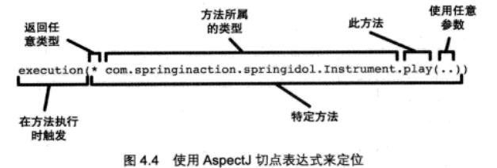

### 4 面向切面的Spring

#### 4.1 面向切面编程

* 通知 (Advice) 定义了切面是什么以及何时使用     
>Spring5种类型的通知:        
a.前置通知    
b.后置通知    
c.返回通知    
d.异常通知    
e.环绕通知


* 连接点 (Join point)    
>连接点是在应用执行过程中能够插入切面的一个点

* 切点 (Pointcut)   
>切点的定义会匹配通知所要织入的一个或多个连接点

* 切面(Aspect)
> 通知和切点的结合

* 引入(Introduction)
> 引入允许我们向现有的类添加新方法或属性

* 织入(Weaving)
> 织入是把切面应用到目标对象并创建新的代理对象的过程   
> 织入时期: 编译期,类加载期,运行期

* Spring提供了4种类型的AOP支持

```
1.基于代理的经典Spring AOP
2.纯POJO切面
3.@AspectJ注解驱动的切面
4.注入式AspectJ切面(适用于Spring各版本)
```

> 前三种是Spring AOP实现的变体,Spring AOP构建在动态代理基础上,因此,Spring 对AOP的支持局限于方法拦截   
> Spring 运行时才创建代理对象   
> Spring 只支持方法级别的连接点

#### 4.2 通过切点选择连接点

* Spring 仅支持AspectJ切点指示器的一个子集

> Spring所支持的的AspectJ切点指示器

|AspectJ指示器|描述|
|:---|:-----|
|arg()|限制连接点匹配参数为指定类型的执行方法|
|@arg()|限制连接点匹配参数由指定注解标注的执行方法|
|execution()|用于匹配是连接点的执行方法|
|this()|限制连接点匹配AOP代理的Bean引用为指定类型的类|
|target()|限制连接点匹配目标对象为指定类型的类|
|@target()|限制连接点匹配特定的执行对象，这些对象对应的类要具备指定类型的注解|
|within()|限制连接点匹配指定的类型|
|@within()|限制连接点匹配指定注解所标注的类型|
|@annotation|限制匹配带有指定注解连接点|

> 只有execution指示器是唯一的执行匹配，而其他的指示器都是用于限制匹配的。这说明execution指示器是我们在编写切点定义时最主要使用的指示器。

* 切点编写方法


* 可以使用操作符 `||  &&　!`

* Spring 引入了一个新的bean() 指示器，允许我们在切点表达式中使用bean的ID来标识bean
> ` execution(* zhanglw.springinaction.study.s1.demo.AOP.test()) and !bean('woodstock') ``


#### 4.3 使用注解创建切面

* 使用注解来创建切面是AspectJ5所引入的关键特性

* Spring使用AspectJ注解来声明通知方法

|注解|通知|
|:----|:----|
|@After|在目标方法返回或抛出异常后调用|
|@AfterReturning|会在目标方法返回后调用|
|@AfterThrowing|会在目标方法抛出异常后调用|
|@Around|会将目标方法封装起来|
|@Before|会在目标方法调用之前执行|

* @PointCut 注解能够在@AspectJ切面内定义可重用的切点

* @EnableAspectJAutoProxy 注解启用自动代理功能

* 环绕通知 @Around  
> ProceedingJoinPoint的preed()方法

* 切点表达式指定参数 
> execution(* package.Test.play(int)) && args(count)

* 通过注解引入新功能
> 通过@DeclareParents声明


#### 4.4 在xml中声明切面

* Spring AOP 配置元素,如<aop:advisor>等

* 表达式使用 and or  not 做操作符

#### 4.5 其他知识点

* 和AspectJ相比,Spring AOP是一个功能较弱的AOP解决方案

* 注入AspectJ切面
> Spring 通过aspectof()的工厂方法获得切面的引用

